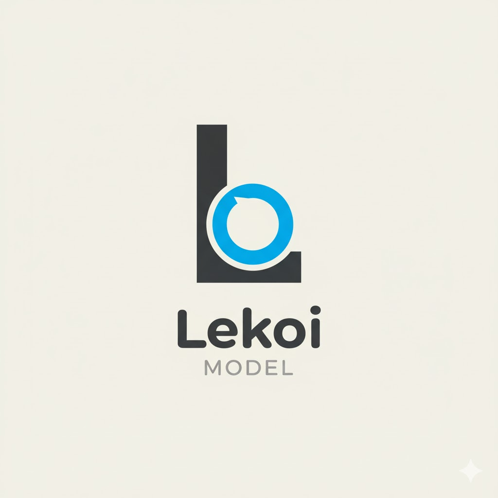

# 🧩 lekoi-model

<p align="center">

</p>

A lightweight database abstraction / ORM-like model component for the Lekoi PHP framework.  
Supports **MySQL (mysqli)** and **SQLite3** through a consistent interface, and provides a simple **DB facade** and base **Model** capabilities.

---

## 🚀 Features

- Simple CRUD operations: `insert()`, `update()`, `delete()`, `get()`, `result()`, `row()`
- Works with both MySQL (`mysqli`) and SQLite3 with one unified API
- DB facade (`DB::…`) for convenient static access
- Base `Model` class support (if you add it) for cleaner domain models
- Lightweight and minimal dependencies (just `php-util` currently)

---

## 📦 Installation

Via Composer:

```bash
composer require iescarro/lekoi-model
```

Then in your project’s composer.json, you’ll get Lekoi\ namespace autoloaded pointing to the src/ directory.

## 📁 Directory Structure (Recommended)

```pgsql
lekoi-model/
├── src/
│   ├── Database/
│   │   ├── MySQLDatabase.php
│   │   ├── SQLiteDatabase.php
│   │   └── IDatabase.php
│   ├── DB.php
│   └── Model.php
├── tests/
│   └── (unit tests)
├── .env.example
├── composer.json
└── README.md
```

## 🧰 Usage

### 1. Configure DB Facade

Before using DB, initialize it with your connection settings (e.g. in your app’s bootstrap or index.php):

```php
DB::init([
    'driver'   => 'mysqli',       // or 'sqlite3'
    'host'     => getenv('DB_HOST'),
    'port'     => getenv('DB_PORT'),
    'dbname'   => getenv('DB_DATABASE'),
    'username' => getenv('DB_USERNAME'),
    'password' => getenv('DB_PASSWORD'),
]);
```

For SQLite you might do:

```php
DB::init([
    'driver' => 'sqlite3',
    'dbname' => __DIR__ . '/data/database.sqlite',
]);
```

### 2. CRUD Examples

```php
// Insert
DB::insert('users', [
    'name' => 'Alice',
    'email' => 'alice@example.com',
]);

// Update
DB::update(
    'users',
    ['email' => 'alice.new@example.com'],
    ['id' => 1]
);

// Delete
DB::delete('users', [
    'id' => 1
]);

// Get rows
$rows = DB::get('users', ['status' => 'active'])->result();

foreach ($rows as $row) {
    echo $row['name'] . PHP_EOL;
}

// Get single row (if you define row())
$user = DB::get('users', ['id' => 2])->row();
```

## 🧬 (Optional) Model Extension

You can build a base Model class to streamline usage in your domain classes:

```php
class Model
{
    protected $table;
    protected $primaryKey = 'id';
    protected $attributes = [];

    public function __construct(array $attrs = [])
    {
        $this->attributes = $attrs;
    }

    public function save(): bool
    {
        if (isset($this->attributes[$this->primaryKey])) {
            return DB::update(
                $this->table,
                $this->attributes,
                [$this->primaryKey => $this->attributes[$this->primaryKey]]
            );
        } else {
            return DB::insert($this->table, $this->attributes);
        }
    }

    public static function find(int $id): ?self
    {
        $row = DB::get(static::$table, [static::$primaryKey => $id])->row();
        return $row ? new static($row) : null;
    }
}
```

Then your domain model:

```php
class User extends Model
{
    protected $table = 'users';
    protected $primaryKey = 'id';
    // optionally define fillable or guarded etc.
}
```

Usage:

```php
$user = User::find(1);
$user->name = 'Bob';
$user->save();

$users = DB::get('users')->result();
```

## 🧪 Testing

You can add unit tests (e.g. using PHPUnit) under tests/ to ensure your DB and Database classes behave as expected across both drivers.
Add the test dependency to composer.json under require-dev.

Run tests via:

```bash
composer test
```

## ⚙️ Configuration & Best Practices

- Validate table & column names (e.g. alphanumeric + underscores) to avoid SQL injection risks.
- Use environment variables or a config file to keep credentials outside version control.
- Consider connection pooling or persistent connections for production use.
- Log queries (e.g. via a queryLog() method) to help debugging.
- Extend support for more drivers (PostgreSQL, SQL Server, etc.) by implementing new driver classes that adhere to IDatabase.

## 📜 License

This project is licensed under the MIT License — see the LICENSE file for details.

## 💡 Contribution

Contributions, issues, and feature requests are welcome! Please feel free to:

- Open a bug report or feature request
- Submit pull requests
- Add tests for new features or drivers

## 🧷 References & Inspiration

- CodeIgniter 3’s Model / Database pattern
- Laravel’s Eloquent / DB facade design
- Doctrine / other ORMs as inspiration for future expansion
